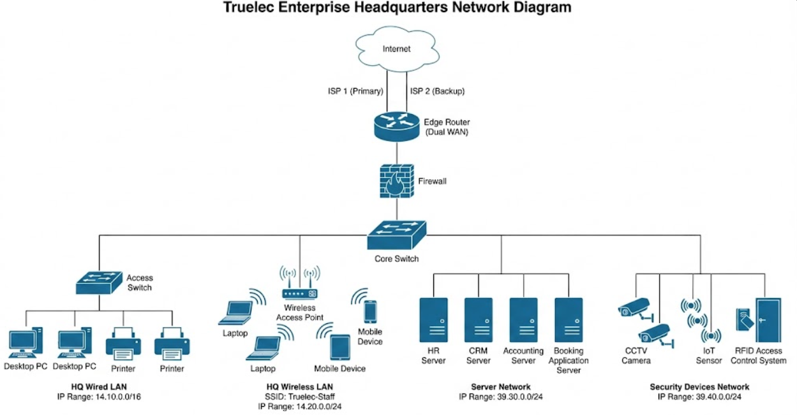
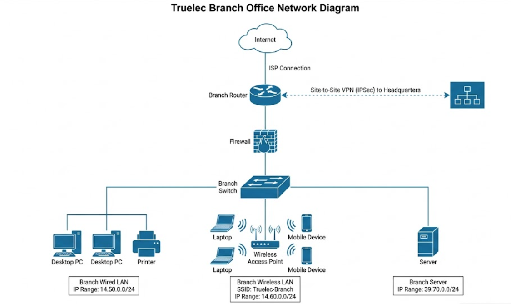

# Network Design
This section gives the detailed network design.

[Assumptions](#assumptions) | [Network Design Diagrams and Justifications](#network-design-diagrams-and-justifications) | [WiFi Design](#wifi-design) | [Address Allocations](#address-allocations) | [Recommended Hardware](#recommended-hardware) | [Plan](./plan.md) | [Cloud Services](./cloud.md) | [Security](./security.md) | [Ethics](./ethics.md) | [Reflection](./reflection.md) | [Return to index](./README.md)

---

## Assumptions

The following assumptions have been made to support the proposed network design. These assumptions are based on the project scenario and are necessary where specific details were not explicitly provided.

- The Truelec headquarters is located in Melbourne, Australia, as the group is based at the Melbourne campus.
- Three branch offices are assumed to be located in Brisbane, Adelaide, and Perth.
- The headquarters employs approximately 60 staff members, including management, administrative staff, project managers, and ICT personnel.
- One branch office is designed in detail and is assumed to have approximately 20 staff members.
- All branch offices have similar networking requirements and use a simplified version of the headquarters network design.
- The organisation requires both wired and wireless network connectivity at all locations.
- Network redundancy is required at the headquarters, particularly for internet connectivity and core networking devices.
- Private IP address ranges (e.g. 192.168.x.x) are not used, and all IP addressing follows the project requirements.

---

## Network Design Diagrams and Justifications

The proposed network design consists of two primary network diagrams: one for the headquarters and one for a branch office. The design follows a hierarchical architecture to improve scalability, manageability, and fault isolation.

### Headquarters Network Design

The headquarters network is designed with redundancy and segmentation in mind. Dual internet service provider (ISP) connections are used to ensure high availability in case of a link or provider failure. Traffic from the internet passes through an edge router and a dedicated firewall before reaching the internal network.

A core switch acts as the central backbone of the network and connects all internal network segments. These segments are logically separated to improve performance, security, and ease of management.

The headquarters network includes:
- A wired LAN for staff workstations and printers
- A wireless LAN for staff mobile devices
- A dedicated server network hosting enterprise applications
- A separate network for security devices such as CCTV cameras, IoT sensors, and RFID access systems

This segmentation reduces the impact of faults, limits the spread of security incidents, and supports future expansion.

### Branch Office Network Design

The branch office network is designed as a simplified and cost-effective extension of the headquarters network. Each branch uses a single internet connection and a router with integrated firewall and VPN functionality.

A site-to-site VPN connects the branch office securely to the headquarters, allowing access to centralised services while protecting data transmitted over public networks. The branch office network includes separate wired and wireless network segments to support staff devices.

### Network Diagrams

The following diagrams illustrate the proposed designs. Editable draw.io files are included in the repository.

### Headquarters Network Diagram

- Editable diagram file: `diagrams/HQ1.drawio`

### Branch Office Network Diagram

- Editable diagram file: `diagrams/Branch1.drawio`

---

## WiFi Design

The wireless network is designed to provide secure and reliable connectivity for staff devices across both headquarters and branch offices.

The following wireless configuration is applied:

- SSID: Truelec-Staff
- Security protocol: WPA3-Enterprise (with WPA2 fallback if required)
- Authentication: Centralised secure authentication
- Frequency bands: Dual-band operation (2.4 GHz and 5 GHz)
- IP assignment: DHCP from a dedicated wireless subnet

At the headquarters, multiple wireless access points are deployed to ensure full coverage of office areas, meeting rooms, and common spaces. The 5 GHz band is prioritised to support higher throughput and reduced interference.

Branch offices deploy fewer access points based on office size and user density but use the same SSID and security settings to maintain consistency across the organisation.

---

## Address Allocations

The IP addressing scheme follows the project requirements and uses only /16 and /24 subnet masks. All IP addresses begin with the last two digits of a group member’s student ID.

The following address allocations are used:

| Network Segment | IP Address Range |
|----------------|------------------|
| Headquarters Wired LAN | 14.10.0.0/16 |
| Headquarters Wireless LAN | 39.20.0.0/24 |
| Server Network | 14.30.0.0/24 |
| Security Devices Network | 39.40.0.0/24 |
| Branch Wired LAN | 14.50.0.0/24 |
| Branch Wireless LAN | 39.60.0.0/24 |

This structured addressing scheme simplifies network management, supports scalability, and avoids address conflicts across different network segments.

---

## Recommended Hardware

The following enterprise-grade hardware is recommended to support the proposed network design. The selections prioritise reliability, performance, and scalability.

- Edge Router: Enterprise dual-WAN router capable of handling multiple ISP connections and VPN services
- Firewall: Dedicated next-generation firewall with stateful inspection and VPN support
- Core Switch: Layer 2/Layer 3 capable switch with high throughput and multiple VLAN support
- Access Switches: Gigabit Ethernet switches for connecting end-user devices
- Wireless Access Points: Dual-band enterprise wireless access points supporting WPA3 security
- Servers: Rack or tower servers suitable for hosting enterprise applications and databases

Using enterprise-grade hardware ensures long-term stability, improved security, and compatibility across headquarters and branch offices.
