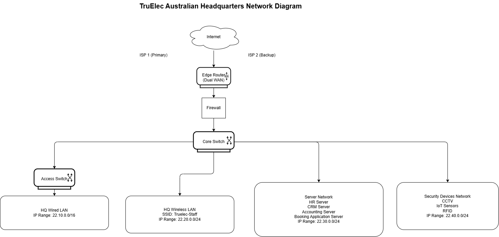

## Assumptions

The project scenario does not specify all organisational and technical details. Therefore, the following assumptions have been made to support the proposed network design. These assumptions are realistic, comply with the project requirements, and represent a medium-sized Australian organisation.

### Headquarters Location

The headquarters of Truelec is assumed to be located in Brisbane, Queensland, Australia.

Justification:  
Brisbane is a major Australian metropolitan city with well-developed ICT infrastructure, access to enterprise-grade internet service providers, and a skilled professional workforce. These factors make it a suitable location for hosting the organisation’s central administrative, operational, and IT services.

### Branch Office Locations

The organisation is assumed to operate three branch offices in the following Australian cities:
- Perth, Western Australia  
- Adelaide, South Australia  
- Hobart, Tasmania  

Justification:  
These locations align with the scenario description and provide broad geographic coverage across Australia. Each city supports industrial, construction, and infrastructure-related activities, which are relevant to the organisation’s operations.

### Number of Staff at Headquarters

The headquarters is assumed to employ 60 staff members.

Justification:  
This figure falls within the required range of 50 to 75 staff and represents a medium-sized headquarters comprising senior management, project managers, marketing personnel, and ICT staff. It also allows sufficient capacity for future growth.

### Number of Staff at Branch Office

Each branch office is assumed to employ 20 staff members.

Justification:  
This number satisfies the requirement of 15 to 30 staff per branch office and reflects a typical operational branch consisting of electricians, electrical engineers, site supervisors, and administrative support staff.

### Scope of Branch Network Design

For this project, a detailed network design is provided for one branch office. It is assumed that the remaining branch offices will implement a similar network architecture and configuration.

Justification:  
Branch offices are expected to have comparable operational requirements. Designing a single branch network provides a scalable and repeatable model that can be consistently applied to other branch locations.

## IP Addressing Plan

A structured IP addressing scheme has been designed to support the headquarters and branch office networks. The addressing plan ensures logical separation of network segments, scalability, and ease of management. All IP address ranges comply with the project requirements, using only /16 or /24 network masks, and the first octet of all IP addresses is based on the last two digits of a group member’s student ID.

### IP Addressing Design Principles

The following principles were applied when designing the IP addressing scheme:
- Clear separation between headquarters and branch office networks
- Dedicated address ranges for servers and wireless networks
- Use of summarised address blocks to allow future expansion
- Compliance with public-style addressing, avoiding private IP ranges

---

### Headquarters IP Address Allocation

| Network Segment | Purpose | IP Address Range | Subnet Mask |
|-----------------|---------|------------------|-------------|
| HQ Wired LAN | Wired user devices and office systems | 22.10.0.0/16 | 255.255.0.0 |
| HQ Wireless LAN | Staff wireless devices | 22.20.0.0/24 | 255.255.255.0 |
| HQ Server Network | Internal servers and application services | 22.30.0.0/24 | 255.255.255.0 |
| HQ Security Devices | CCTV, IoT sensors, RFID access systems | 22.40.0.0/24 | 255.255.255.0 |

Justification:  
A /16 network has been allocated to the headquarters wired LAN to support a larger number of devices and allow future growth. Separate /24 networks are used for wireless access, servers, and security devices to improve organisation, manageability, and fault isolation.

---

### Branch Office IP Address Allocation

| Network Segment | Purpose | IP Address Range | Subnet Mask |
|-----------------|---------|------------------|-------------|
| Branch Wired LAN | Branch office wired devices | 22.50.0.0/24 | 255.255.255.0 |
| Branch Wireless LAN | Branch staff wireless devices | 22.60.0.0/24 | 255.255.255.0 |

Justification:  
Each branch office is assigned separate /24 networks for wired and wireless connectivity. This provides sufficient address space for branch operations while maintaining simplicity and consistency across branch locations.

---

### Scalability and Future Expansion

The IP addressing scheme allows additional networks and devices to be added without major restructuring. Additional branch offices can be allocated new /24 networks following the same addressing pattern, ensuring consistency across the organisation.

---

### Summary

This IP addressing plan provides a logical, scalable, and standards-compliant structure for the organisation’s network. It supports current operational requirements while allowing for future expansion and simplified network management.

## Network Architecture Design

This section describes the proposed network architecture for the headquarters and one branch office. The design focuses on reliability, scalability, and simplicity, while ensuring continuous availability of critical services.

---

### Headquarters Network Architecture

The headquarters network is designed using a hierarchical network architecture consisting of an edge layer, core layer, and access layer. This approach improves manageability, fault isolation, and scalability.

#### Internet Connectivity and Edge Layer
The headquarters is connected to the internet using two independent ISP links, a primary and a secondary connection. These links terminate at an enterprise-grade edge router that supports dual-WAN connectivity and automatic failover.

A dedicated firewall is deployed between the edge router and the internal network. The firewall is responsible for traffic filtering, access control, and protection against external threats.

Justification:  
Dual ISP links ensure high availability, while the firewall provides a security boundary between external networks and internal systems.

---

#### Core and Access Layer
A core switch acts as the backbone of the headquarters network and connects all major network segments, including access switches, servers, and security systems.

Multiple access switches are connected to the core switch to support wired user devices such as desktop computers, printers, and office equipment.

Justification:  
Separating the core and access layers reduces network congestion and simplifies future expansion by allowing additional access switches to be added without redesigning the network.

---

#### Server and Internal Services Network
A dedicated server network segment is used to host internal services, including HR systems, accounting software, CRM systems, and the organisation’s booking application.

Servers are connected directly to the core switch to ensure high-speed and reliable access from all departments.

Justification:  
Centralising servers within a dedicated network segment improves performance, security, and ease of management.

---

#### Wireless Network Architecture
Enterprise-grade wireless access points are deployed throughout the headquarters to provide wireless connectivity for staff devices. Access points are connected to access switches and centrally managed.

Wireless traffic is logically separated from wired traffic using a dedicated wireless IP range.

Justification:  
This design ensures seamless mobility for staff while maintaining control over wireless access and performance.

---

#### Security Devices Network
Security-related devices such as CCTV cameras, IoT sensors, and RFID access control systems are connected to a dedicated security network segment.

Justification:  
Isolating security devices improves monitoring, simplifies troubleshooting, and reduces the impact of potential faults or security incidents.

---

### Branch Office Network Architecture

The branch office network is designed as a simplified version of the headquarters network while maintaining consistency and security.

#### Branch Connectivity
Each branch office connects to the internet using a single ISP link terminated at a branch router with integrated firewall functionality. A secure site-to-site VPN tunnel is established between the branch router and the headquarters firewall.

Justification:  
The VPN ensures secure communication between branch offices and the headquarters over the public internet.

---

#### Branch Internal Network
The branch router connects to a local access switch that supports wired devices. Wireless access points provide WiFi connectivity for branch staff.

Wired and wireless devices are assigned separate IP address ranges, consistent with the overall IP addressing scheme.

Justification:  
This structure provides sufficient capacity for branch operations while maintaining simplicity and standardisation across locations.

---

### Redundancy and Reliability Considerations

Redundancy is implemented at the headquarters level through dual internet connections and robust core infrastructure. Branch offices rely on stable ISP connectivity and secure VPN links to access central resources.

Justification:  
This approach balances cost and reliability, ensuring high availability where it is most critical while maintaining efficient branch operations.

---

### Design Summary

The proposed network architecture provides a reliable, scalable, and easy-to-manage solution for the organisation. The hierarchical design, combined with redundancy at the headquarters and secure connectivity for branch offices, ensures continuous availability of services and supports future growth.

## Hardware Selection and Specifications

This section lists the recommended network hardware for the headquarters and branch office. The selected devices are enterprise-grade, support redundancy and scalability, and are suitable for a medium-sized organisation. All prices are indicative and listed in Australian Dollars (AUD).

---

### Headquarters Network Hardware

| Device Type | Recommended Model | Minimum Specifications | Approx. Price (AUD) | Justification |
|------------|------------------|------------------------|---------------------|---------------|
| Edge Router | Cisco ISR 4331 | Dual WAN support, Gigabit Ethernet, VPN support | $4,500 | Supports dual ISP links, secure WAN connectivity, and scalable performance for headquarters traffic |
| Firewall | Fortinet FortiGate 60F | Stateful firewall, IPS, VPN, application control | $2,200 | Provides strong perimeter security, threat prevention, and secure remote connectivity |
| Core Switch | Cisco Catalyst 9300 | 24–48 Gigabit ports, Layer 3 support | $6,000 | High-performance backbone switch suitable for enterprise core networking |
| Access Switch | Cisco Catalyst 9200 | 24 Gigabit ports, PoE support | $3,200 | Reliable access-layer switching with PoE support for wireless access points |
| Wireless Access Point | Cisco Meraki MR36 | Dual-band WiFi 6, central management | $1,800 | Provides high-performance and secure wireless coverage for staff devices |

---

### Branch Office Network Hardware

| Device Type | Recommended Model | Minimum Specifications | Approx. Price (AUD) | Justification |
|------------|------------------|------------------------|---------------------|---------------|
| Branch Router | Cisco ISR 1100 Series | Integrated firewall, VPN support | $1,800 | Suitable for small branch connectivity with secure VPN access to headquarters |
| Access Switch | Cisco Catalyst 9200 | 24 Gigabit ports, PoE support | $3,200 | Provides reliable wired connectivity for branch staff and devices |
| Wireless Access Point | Cisco Meraki MR36 | Dual-band WiFi 6 | $1,800 | Ensures consistent wireless performance across headquarters and branch locations |

---

### Hardware Selection Summary

The selected hardware supports high availability, secure communication, and future scalability. Enterprise-grade devices have been chosen to ensure reliability, consistent performance, and compatibility across headquarters and branch networks. Using similar vendors across the organisation simplifies management, configuration, and long-term maintenance.

## Wireless Network Design

This section describes the wireless network design for the headquarters and branch office. The wireless network is designed to provide secure, reliable, and high-performance connectivity for staff while supporting mobility and scalability.

---

### Wireless Network Requirements

The wireless network must support:
- Staff laptops, tablets, and mobile devices
- Secure authentication and encryption
- Reliable coverage across office areas
- Minimal interference and optimal performance

---

### Wireless Network Configuration

The following wireless configuration is applied consistently across the headquarters and branch offices.

| Parameter | Configuration |
|---------|---------------|
| SSID Name | Truelec-Staff |
| Security Protocol | WPA3-Enterprise (fallback to WPA2 if required) |
| Authentication | Centralised authentication using secure credentials |
| Frequency Bands | Dual-band operation (2.4 GHz and 5 GHz) |
| Channel Allocation | Automatic channel selection to reduce interference |
| IP Assignment | DHCP from designated wireless IP subnet |

---

### Headquarters Wireless Design

Multiple enterprise-grade wireless access points are deployed across the headquarters to ensure complete coverage of office areas, meeting rooms, and common spaces. Access points are strategically positioned to minimise signal overlap and dead zones.

The 5 GHz band is prioritised for staff devices to achieve higher throughput and reduced interference, while the 2.4 GHz band is available for legacy or low-bandwidth devices.
### Headquarters Network Diagram

Justification:  
This approach ensures reliable wireless performance for a high number of users while maintaining compatibility with different device types.

---

### Branch Office Wireless Design

Branch offices deploy a smaller number of wireless access points based on office size and user density. The same SSID name and security configuration are used to maintain consistency across all locations.
### Branch Office Network Diagram

Justification:  
Using a standardised wireless configuration simplifies management, reduces configuration errors, and ensures a consistent user experience for staff across headquarters and branch offices.

---

### Wireless Security Considerations

Wireless traffic is logically separated from wired traffic using a dedicated wireless IP address range. Strong encryption and secure authentication mechanisms are enforced to protect against unauthorised access.

Justification:  
These measures reduce the risk of wireless-based attacks and ensure that only authorised staff devices can access internal network resources.

---

### Wireless Design Summary

The proposed wireless design delivers secure, scalable, and high-performance connectivity suitable for a medium-sized enterprise. The design supports current operational requirements while allowing for future expansion as the number of wireless devices increases.

##  Design Justification and Summary

This section provides an overall justification of the proposed network design and summarises how the design meets the organisational and technical requirements outlined in the project scenario.

---

### Design Justification

The proposed network design for Truelec has been developed with a strong focus on reliability, scalability, simplicity, and operational efficiency.

A hierarchical network architecture has been implemented at the headquarters to clearly separate the edge, core, and access layers. This structure simplifies network management, improves fault isolation, and allows the network to scale easily as the organisation grows. Redundancy has been incorporated at critical points, particularly through dual internet connections at the headquarters, ensuring continued availability of services in the event of link or provider failure.

Branch office networks are designed as simplified yet secure extensions of the headquarters network. Secure site-to-site VPN connectivity enables branches to access centralised services while protecting data transmitted over public networks. This approach balances cost efficiency with security and operational needs.

The IP addressing scheme follows a logical and structured format that separates wired, wireless, server, and security device networks. This improves network clarity, simplifies troubleshooting, and supports future expansion without requiring major reconfiguration.

Wireless networking has been designed using enterprise-grade access points and secure authentication mechanisms. Dual-band operation ensures high performance while maintaining compatibility with different device types. Consistent wireless configuration across all locations reduces administrative complexity and enhances the user experience.

Enterprise-grade hardware has been selected to ensure long-term reliability, security, and compatibility across the organisation. Using similar vendor platforms for headquarters and branch offices simplifies configuration, monitoring, and maintenance.

---

### Design Summary

The proposed network design provides a robust and scalable solution suitable for a medium-sized Australian organisation with multiple branch locations. The design supports current operational requirements while allowing for future growth, improved reliability, and secure communication between sites.

Overall, the network architecture delivers a balanced combination of performance, security, and manageability, making it well suited to support Truelec’s ongoing business operations and strategic expansion.

